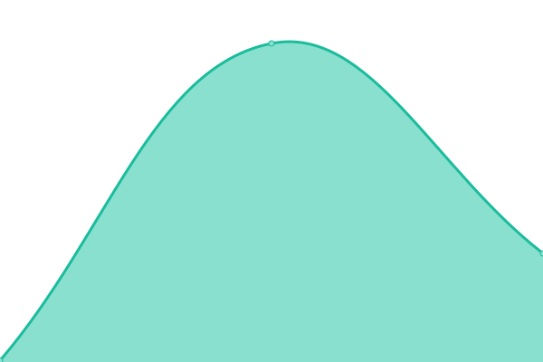

# 📊 Priced In — Status Page

This repository contains the uptime monitoring history for all **Priced In** finance tools.

> Status page auto-generated by [Upptime](https://github.com/upptime/upptime)

<!--start: status pages-->
<!-- This summary is generated by Upptime (https://github.com/upptime/upptime) -->
<!-- Do not edit this manually, your changes will be overwritten -->
<!-- prettier-ignore -->
| URL | Status | History | Response Time | Uptime |
| --- | ------ | ------- | ------------- | ------ |
|  [🏠 Priced In HQ](https://pricedinhq.vercel.app) | 🟩 Up | [priced-in-hq.yml](https://github.com/rohith547/status/commits/HEAD/history/priced-in-hq.yml) | 

 175ms
     
 | 

<a href="https://rohith547.github.io/status/history/priced-in-hq">100.00%</a>
    

|  [📈 Market Pulse](https://pricedin-pulse.vercel.app) | 🟩 Up | [market-pulse.yml](https://github.com/rohith547/status/commits/HEAD/history/market-pulse.yml) | 

 139ms
     
 | 

<a href="https://rohith547.github.io/status/history/market-pulse">100.00%</a>
    

|  [🏦 Rate Pulse](https://pricedin-refi.vercel.app) | 🟩 Up | [rate-pulse.yml](https://github.com/rohith547/status/commits/HEAD/history/rate-pulse.yml) | 

 129ms
     
 | 

<a href="https://rohith547.github.io/status/history/rate-pulse">100.00%</a>
    

|  [🏛️ Fed Watch](https://pricedin-fed.vercel.app) | 🟩 Up | [fed-watch.yml](https://github.com/rohith547/status/commits/HEAD/history/fed-watch.yml) | 

 134ms
     
 | 

<a href="https://rohith547.github.io/status/history/fed-watch">100.00%</a>
    

|  [📊 Earnings Pulse](https://pricedin-earnings.vercel.app) | 🟩 Up | [earnings-pulse.yml](https://github.com/rohith547/status/commits/HEAD/history/earnings-pulse.yml) | 

 143ms
     
 | 

<a href="https://rohith547.github.io/status/history/earnings-pulse">100.00%</a>
    

|  [🔍 Insider Tracker](https://pricedin-insider.vercel.app) | 🟩 Up | [insider-tracker.yml](https://github.com/rohith547/status/commits/HEAD/history/insider-tracker.yml) | 

 127ms
     
 | 

<a href="https://rohith547.github.io/status/history/insider-tracker">100.00%</a>
    

|  [🧠 Macro Lens](https://pricedin-macro.vercel.app) | 🟩 Up | [macro-lens.yml](https://github.com/rohith547/status/commits/HEAD/history/macro-lens.yml) | 

 209ms
     
 | 

<a href="https://rohith547.github.io/status/history/macro-lens">100.00%</a>
    

|  [💵 Follow the Money](https://pricedin-ftm.vercel.app) | 🟩 Up | [follow-the-money.yml](https://github.com/rohith547/status/commits/HEAD/history/follow-the-money.yml) | 

 118ms
     
 | 

<a href="https://rohith547.github.io/status/history/follow-the-money">100.00%</a>
    

|  [🔥 Short Squeeze](https://pricedin-squeeze.vercel.app) | 🟩 Up | [short-squeeze.yml](https://github.com/rohith547/status/commits/HEAD/history/short-squeeze.yml) | 

 220ms
     
 | 

<a href="https://rohith547.github.io/status/history/short-squeeze">100.00%</a>
    

|  [🏢 13F Tracker](https://pricedin-13f.vercel.app) | 🟩 Up | [13-f-tracker.yml](https://github.com/rohith547/status/commits/HEAD/history/13-f-tracker.yml) | 

 138ms
     
 | 

<a href="https://rohith547.github.io/status/history/13-f-tracker">100.00%</a>
    

|  [📡 Signal Scanner](https://pricedin-scanner.vercel.app) | 🟩 Up | [signal-scanner.yml](https://github.com/rohith547/status/commits/HEAD/history/signal-scanner.yml) | 

 185ms
     
 | 

<a href="https://rohith547.github.io/status/history/signal-scanner">100.00%</a>
    

|  [📱 App Pulse](https://pricedin-apps.vercel.app) | 🟩 Up | [app-pulse.yml](https://github.com/rohith547/status/commits/HEAD/history/app-pulse.yml) | 

 106ms
     
 | 

<a href="https://rohith547.github.io/status/history/app-pulse">0.00%</a>
    

<!--end: status pages-->

## 🔗 Tools Monitored

| Tool             | URL                                  |
| ---------------- | ------------------------------------ |
| Priced In HQ     | https://pricedinhq.vercel.app        |
| Market Pulse     | https://pricedin-pulse.vercel.app    |
| Rate Pulse       | https://pricedin-refi.vercel.app     |
| Fed Watch        | https://pricedin-fed.vercel.app      |
| Earnings Pulse   | https://pricedin-earnings.vercel.app |
| Insider Tracker  | https://pricedin-insider.vercel.app  |
| Macro Lens       | https://pricedin-macro.vercel.app    |
| Follow the Money | https://pricedin-ftm.vercel.app      |
| Short Squeeze    | https://pricedin-squeeze.vercel.app  |
| 13F Tracker      | https://pricedin-13f.vercel.app      |
| Signal Scanner   | https://pricedin-scanner.vercel.app  |
| App Pulse        | https://pricedin-apps.vercel.app     |

## ⚙️ How it works

- GitHub Actions checks every site **every hour**
- Opens a GitHub Issue automatically when a site goes down
- Closes the Issue automatically when back up
- Tracks 90-day uptime % and response time history
